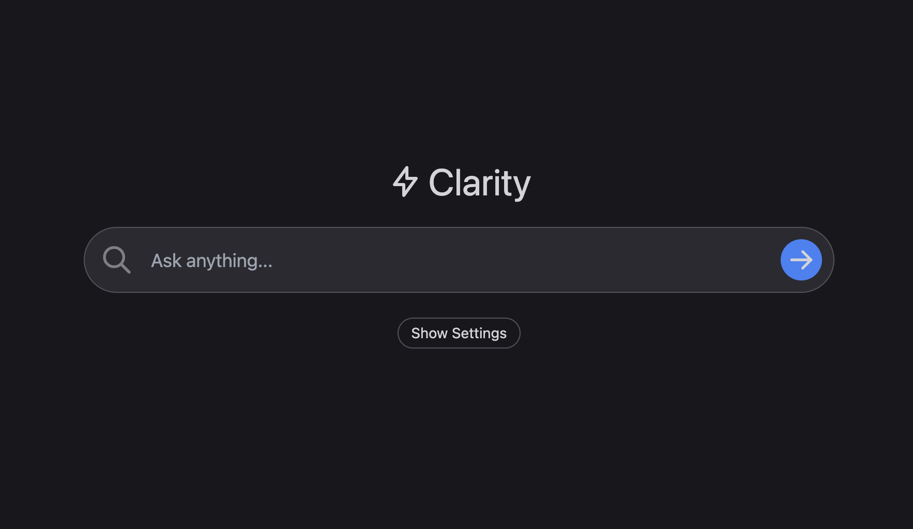

Build your own Perplexity AI clone with [Prem](https://premai.io) using the `Dolly v2 12B` model, self-hosted on [Paperspace Cloud](https://www.paperspace.com/gpu-cloud) virtual server.

<!--truncate-->

## What is Perplexity AI?

Perplexity AI is a conversational search engine and chatbot that acts as a search engine that scans the internet to provide users with straightforward answers to their questions. It is a great tool for students, researchers, and anyone who wants to learn more about a topic.

## What is Prem?

Prem is a self-hosted AI platform that allows you to test and deploy open-source AI models on your own infrastructure. Prem is open-source and free to use. You can learn more about Prem [here](https://premai.io).

## How to build Perplexity AI on Prem


### Overview

For this tutorial we are going to use the **fantastic** open-source frontend [Clarity AI](https://github.com/mckaywrigley/clarity-ai) built by [Mckay Wrigley](https://github.com/mckaywrigley). 👏 Kudos to him for building such a great tool!

Since `ClarityAI` uses ChatGPT by OpenAI, the integration with Prem it's staightforward as we only need to change the API endpoint and use a random string as API key, to skip the authentication.

As infrastructure, we are going to use [Paperspace Cloud](https://www.paperspace.com/gpu-cloud). You can use any other cloud provider or your own server with a NVIDIA GPU.


### Step 1: Clone the Clarity AI repository

First, we need to clone the Clarity AI repository. We are going to use the follwing commit hash [`5a33db1`](https://github.com/mckaywrigley/clarity-ai/commit/5a33db140d253f47da3f07ad1475938c14dfda45) for future reference.

```bash
git clone https://github.com/mckaywrigley/clarity-ai
```

### Step 2: Little tweaks (optional)


> ℹ️ **skip this step** You can use my own `clarity-ai` fork [github.com/tiero/clarity-ai](https://github.com/tiero/clarity-ai)

***

1. Open the `clarity-ai` project with your editor of choice. I'm using [Visual Studio Code](https://code.visualstudio.com/).

2. Open the `components/Search.tsx` file, at line 16 we need to pre-populate the `apiKey` state with a random string. 


```typescript
const [apiKey, setApiKey] = useState<string>("X".repeat(51));
```

This is needed because we are not going to use the authentication system of OpenAI and Prem is currently exposing the endpoints without authentication.

3. Open the `utils/answer.ts` file, at line 8 we need to change the API endpoint from OpenAI to be sourced from environment variable `NEXT_PUBLIC_API_URL`

```typescript
`${process.env.NEXT_PUBLIC_API_URL}/v1/chat/completions`
```

Done! 🎉

### Step 3: Install Prem on Paperspace


Create a Paperspace account if you don't have one already, then login to the [Paperspace Console](https://console.paperspace.com/).

1. Create a machine with the following specs:

- **Machine Type**: `P6000`, `V100-32G`, `A100`, `A100-80G`, `A5000`, `A6000`
- **GPU**: `NVIDIA GPU`
- **Machine OS**: `ML-in-a-Box`
- **Machine Storage**: `50 GB`
- **Memory**: min 24 GiB

2. Connect to the instance via SSH

```bash
ssh paperspace@<your-instance-ip>
```

3. Install Prem

```bash
wget -q https://get.prem.ninja/install.sh -O install.sh; sudo bash ./install.sh
```

4. Check the app is live.

Visit the following URL in your browser: `http://<your-instance-ip>:8000` to confirm the Prem App is up and running.

### Step 4: Download the model 

From the Prem App, select the `Dolly v2 12B` model and click on the **dowload** icon.

### Step 5: Run the model

From the Prem App, select the `Dolly v2 12B` model and click on Open. This will start the container and open the chat UI. At this point we don't need the embedded user interface, so we can close it.

### Step 6: Run the app

Now back to the frontend, let's run it locally and connect to our Prem instance.

1. Set the right environment variable 

```bash
export NEXT_PUBLIC_API_URL=http://<your-instance-ip>:8000
```

2. Install the dependencies

```bash
npm install
```

3. Run the frontend

```bash
npm run dev
```


### Step 7: Enjoy!

Visit the following URL in your browser: `http://localhost:3000` to start using your own Perplexity AI clone!

